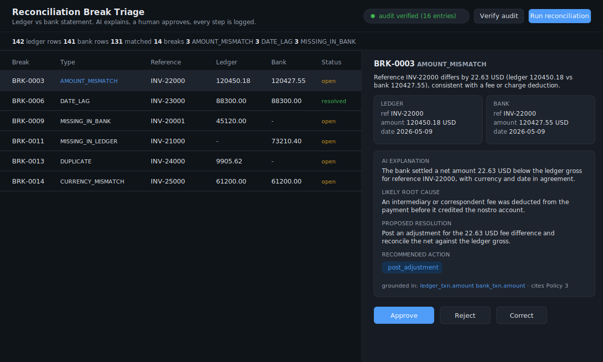

# Reconciliation Break Triage Agent

**Clearing and settlement operations have to explain and resolve every break
between their internal ledger and the bank statement, and prove to a regulator
that the resolution trail was not altered after the fact.** This system detects
those breaks, has a Claude agent explain each one and propose a resolution, and
requires a human to approve before anything is marked resolved. Every detection,
every AI recommendation, and every human decision is written to a tamper-evident
HMAC-chained audit log.

It is small enough to read in one sitting and runs with no API key (a rule-based
fallback stands in for the agent), so the demo works offline.



> The image above is a UI preview of `web/index.html` rendered with real
> reconciliation data. A separate, drop-in pitch narrative lives in
> [`docs/PITCH.md`](docs/PITCH.md).

## The thirty-second pitch

1. **Deterministic matcher, not a black box.** A pure-logic pass reconciles the
   two books and classifies every mismatch into one of six break types:
   `MISSING_IN_BANK`, `MISSING_IN_LEDGER`, `AMOUNT_MISMATCH`, `DATE_LAG`,
   `DUPLICATE`, `CURRENCY_MISMATCH`. The LLM never sees a break the matcher has
   not already classified.
2. **Grounded agent.** Claude (via a LangGraph workflow) returns a structured
   explanation, likely root cause, proposed resolution, and a recommended action
   from a fixed set. It is grounded only in the break data plus a documented
   resolution policy, references specific fields, and never invents transactions.
3. **Human in the loop.** Operations sees the AI call, then approves, rejects, or
   corrects it. Nothing resolves on its own.
4. **Tamper-evident audit.** Each log entry stores
   `HMAC(secret, prev_hash + canonical_json(entry))`. Editing any line breaks the
   chain from that point on, which `scripts/verify_audit.py` proves.

## Dashboard

The review dashboard lists every break with its type, amounts, and confidence.
Clicking a row generates and shows the AI explanation and recommendation, with
approve / reject / correct controls. A live badge in the header verifies the
audit chain. The layout: breaks table on the left, the selected break's AI call
and decision controls on the right.

## Quickstart

```bash
pip install -r requirements.txt      # installs the package and dependencies
python data/seed_data.py             # generate the two ledgers (reproducible)
uvicorn recon_triage.app:app --reload
# open http://localhost:8000
```

Then in the dashboard: click **Run reconciliation**, select a break to see the
AI recommendation, and approve, reject, or correct it. The audit badge updates
after each action.

To use the live Claude agent instead of the rule-based fallback, set an API key
before starting the server:

```bash
export ANTHROPIC_API_KEY=sk-ant-...
export ANTHROPIC_MODEL=claude-opus-4-8   # optional, this is the default
```

## The verify-tamper demo

This is the auditability claim, made concrete. It builds a small chained log,
verifies it, edits one line, and verifies again to show the break:

```bash
python scripts/verify_audit.py --demo
```

```
1. Fresh audit log with three chained entries:
  OK    chain intact (3 entries verified)
2. Tampering: rewriting the AI recommendation from post_adjustment to write_off...
3. Re-verifying the tampered log:
  FAIL  chain broken at entry index 1
Tamper detected. The edited entry no longer matches its HMAC, so the
resolution trail is provably unaltered when it does verify.
```

To verify the real log produced by the running service:

```bash
python scripts/verify_audit.py audit_log.jsonl
```

## How a break flows through the system

```
ledger.csv ─┐
            ├─▶ matcher.reconcile()  ──▶  Break (type + confidence)
bank.csv  ──┘     (pure logic)                 │
                                               ▼
                              agent.run_agent()  ──▶  Recommendation
                              (LangGraph + Claude, grounded in recon_sop.md)
                                               │
                                               ▼
                              human approves / rejects / corrects
                                               │
                                               ▼
                   audit.AuditLog  ──▶  break_detected, ai_recommendation,
                   (HMAC-chained JSONL)      human_decision
```

## Matching logic

1. **Duplicates** within a book (same reference, amount, currency, and date
   appearing twice) are pulled out first.
2. **Deterministic match:** identical reference, amount, currency, and settlement
   date reconcile cleanly.
3. **Fuzzy pass** on the remainder, grouped by normalized reference, scores
   near-matches: a fee-sized amount difference is an `AMOUNT_MISMATCH`, a one or
   two day settlement gap is a `DATE_LAG`, a matching amount with a different
   currency is a `CURRENCY_MISMATCH`. Each carries a confidence score.
4. **Anything still unmatched** is missing on one side.

## Tests

```bash
python -m pytest
```

`tests/test_matcher.py` asserts each break type is detected correctly (the LLM
is not involved). `tests/test_audit.py` proves the chain verifies when intact and
fails when a payload, a hash, or an entry is altered.

## Layout

```
data/seed_data.py        reproducible two-ledger generator with injected breaks
data/recon_sop.md        the resolution policy the agent grounds against
src/recon_triage/
  schemas.py             Transaction, Break, Recommendation, Decision (pydantic)
  matcher.py             deterministic + fuzzy classification, no LLM
  agent.py               LangGraph node: grounded structured recommendation
  audit.py               HMAC-chained append-only JSONL log
  app.py                 FastAPI service and JSON API
web/index.html           review dashboard
scripts/verify_audit.py  chain verifier and tamper-evidence demo
```

## Deploy

`render.yaml` deploys the service to a live URL on Render. Set `AUDIT_SECRET`
(and optionally `ANTHROPIC_API_KEY`) in the Render dashboard; the build runs
`pip install -r requirements.txt` and the service starts with uvicorn.

## Notes

- Money is carried as `Decimal` end to end, never float, so fee differences and
  tolerances are exact.
- The agent degrades gracefully: on any API failure it falls back to the
  rule-based path rather than fabricating a recommendation, and the fallback is
  labelled as such in its output.
